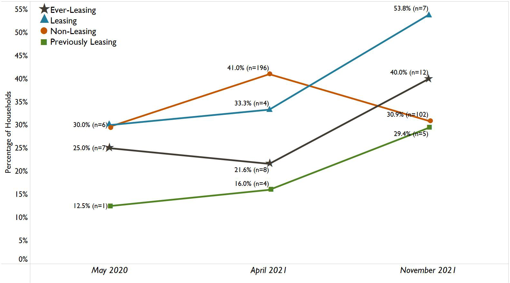
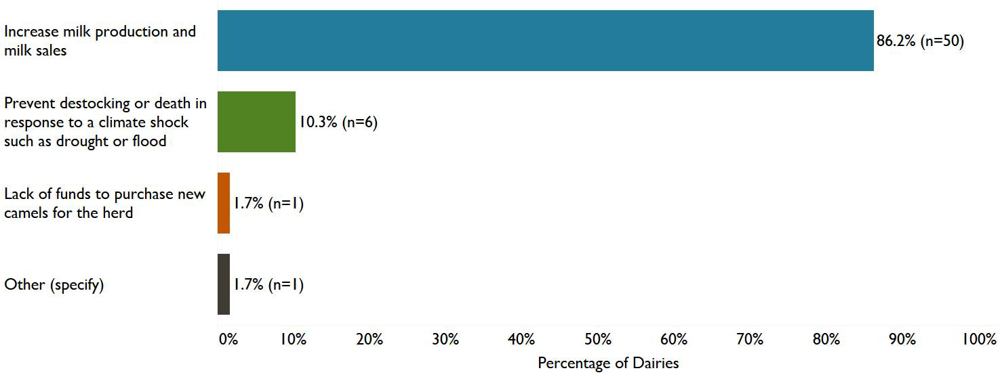

After the severe 2016–2017 drought in Somalia, a formal leasing model offered
camel-herding pastoralists a different way to manage risk. A dairy leases a
lactating camel for an agreed period, pays its owner, and assumes the costs of
feed, water, and veterinary care. The pastoralist gains income without selling
the animal; the dairy gains a steadier milk supply.

The paper by Emily Decker and colleagues asks whether that exchange can build
resilience for pastoralist households, dairy farms, and their communities in
Woqooyi Galbeed, Somaliland.[^paper]

## How the study worked

The research followed the USAID Camel Leasing Activity from June 2019 to March
2022. It combined surveys, focus groups, case studies, and a camel-milk value
chain analysis. Across three rounds, the underlying final report records 46
survey observations from leasing pastoralists, 51 from people who had
previously leased, and 594 from non-leasing pastoralists. It also records 40,
25, and 48 observations, respectively, from dairy farms in those categories.
[^report]

Those numbers need care. Leasing was less common than the researchers expected,
participants sometimes changed their reported status, and migratory livelihoods
made follow-up difficult. The study therefore became exploratory rather than an
impact evaluation. Its comparisons describe associations within the sample;
they do not show that leasing alone caused the differences.

## Income became a buffer

For 71.7% of the currently leasing pastoralists surveyed, lease payments
provided at least half of monthly household income. Among that group, 65.4%
reported that leasing let them save more money. The share able to save rose
over the study period among current and former leasers, although some points in
the figure below represent very small samples.

*Figure A-6 from the [USAID Camel Leasing Activity final report](https://docs.aiddata.org/ad4/pdfs/usaid-archive/PA00ZF7Q.pdf), the study underlying the paper. “Ever-leasing” combines current and former leasers.*

The reported uses of that income matter for resilience: savings can absorb a
shock, while new animals, wells, and other productive assets can change a
household's longer-term capacity. Education was another pathway. Among
pastoralists who had ever leased, 75.9% reported sending children to school
because of lease income. Girls made up an average 54.2% of enrolled children in
ever-leasing households, compared with 46.3% in non-leasing households.

Selection is a plausible part of this pattern. At baseline, leasing
pastoralists tended to be more economically secure and owned more camels. A
household with a larger herd may be better able to risk placing one animal in
someone else's care—and may already have more capacity to save or pay school
fees.

## The business case for dairies

For dairies, leasing was primarily a production strategy. Of farms that had
ever leased, 86.2% said their main reason for starting was to increase milk
production and sales. Nearly half reported that profits had increased because
of leasing, and 41.4% reported accumulating assets such as camels, water
reservoirs, and fodder equipment.

*Figure A-11 from the [USAID Camel Leasing Activity final report](https://docs.aiddata.org/ad4/pdfs/usaid-archive/PA00ZF7Q.pdf).*

Leasing dairies also reported larger herds and growing milk production over
time. That is consistent with a reinforcing cycle: leased animals add milk,
milk adds revenue, and revenue can fund animals and infrastructure. But the
study does not isolate leasing from the pre-existing differences between farms
that did and did not participate.

## Resilience for whom?

The most useful result is not simply that leasing “worked.” It is that benefits
and costs moved through the wider milk system.

- Some households reported less camel milk available for their own
  consumption after leasing.
- Pastoralists worried about animal care, restricted diets, and reduced
  exercise at dairies.
- Expanding dairy herds could intensify pressure on grazing land.
- Larger dairies competed with small milk traders—particularly women who had
  traditionally bought milk from pastoralists and sold it in local markets.

At the same time, participants associated leasing with new jobs, communal
assets, savings groups, and a larger role for women in household budgeting.
The practice may therefore strengthen some resilience capacities while
redistributing income, risk, and market power.

The paper's central contribution is a first empirical account of formal
livestock leasing as a resilience strategy. Its central caution is equally
important: promising associations in a small, self-selecting market are a
reason to test and refine the model, not to assume that it will transfer
unchanged to every pastoral community.

[^paper]: Emily Decker et al., “[Camel leasing as a resilience-building practice: Insights from Somali pastoralist households and dairy farms](https://doi.org/10.1016/j.wdp.2025.100668),” *World Development Perspectives* 37 (2025), 100668.
[^report]: RTI International, *[Feed the Future Somalia Camel Leasing to Impact Resilience Activity: Final Report](https://docs.aiddata.org/ad4/pdfs/usaid-archive/PA00ZF7Q.pdf)*, prepared for USAID, March 2022. The final report contains the study design, detailed results, and figures summarized here.
