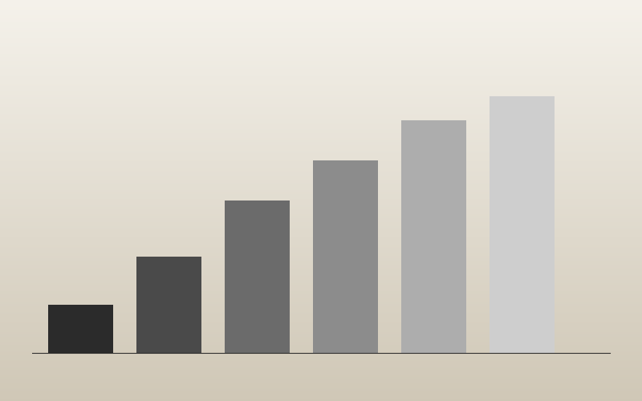

A plate is the most expensive thing on a page. Not in attention — a good plate
earns that back — but in bytes, which the reader pays for whether or not they
ever scroll far enough to see it. On a metered connection the difference
between a careless encode and a measured one is the difference between a page
that opens and a page that is abandoned halfway.[^ostrom]

So every image here is measured before it ships. The rule is a single
number: **encode at the cheapest quality that still holds SSIM ≥ 0.92** against
the source. Below that threshold the eye starts to find the seams; above it,
you are paying for fidelity nobody perceives.

## The ladder, and why it is not the whole story



The theme already hands every plate a width ladder — 320 through 1200,
capped at the source width — plus an AVIF source with a WebP fallback. That
part is free, and it is the larger win. A phone on a 360-point viewport never
downloads the 1200-wide render at all.

But the ladder only chooses *which* file. It says nothing about how hard that
file was squeezed. Two 640-wide renders of the same photograph can differ by a
factor of four depending on the quality setting, and the global default —
`quality = 50` — is a compromise struck for images that do not exist yet. A
flat colour field is wasted at 50. A page of set type falls apart at 50.

> A single global quality is an average of photographs you have not taken yet.
> It is correct for none of them.

### What the measurement actually does

The production build walks every source image, re-encodes new or changed ones
at a descending sweep of quality values, compares each candidate against the
source, and records the lowest quality that still clears the threshold. The
result is cached by the source file's fingerprint, so unchanged images do not
need to be measured again.

This is part of the ordinary site build rather than a separate publishing
chore. An unmeasured plate still has a safe global fallback, but the production
pipeline measures it before the page is published.

If you want the shape of the sweep rather than the plumbing:

```python
def cheapest_quality(source, threshold=0.92):
    for q in range(90, 20, -2):
        if ssim(source, encode(source, quality=q)) < threshold:
            return q + 2
    return 22
```

## The numbers

 and a detailed field (lower)")

The two curves above are the entire argument. A flat field reaches 0.92 by
quality 30 and then flattens; a detailed field is still climbing at 70. One
global setting cannot serve both, and the measurement is what tells them
apart.

| Plate           | Source | AVIF | WebP | Quality | SSIM  |
| --------------- | ------ | ---- | ---- | ------- | ----- |
| plate-ladder    | 412 KB | 38   | 61   | 46      | 0.941 |
| quality-curve   | 206 KB | 17   | 29   | 42      | 0.958 |
| field-notes-i   | 690 KB | 74   | 118  | 54      | 0.927 |
| hairlines-i     | 318 KB | 26   | 44   | 44      | 0.951 |

The full run, all five plates with every intermediate candidate, is here:
[the measurement table](plate-weights.csv). It is small enough to read in a
terminal and boring enough that you probably should not.

### Terms, since the columns are terse

SSIM
: Structural similarity. A perceptual comparison between two images on a
scale of 0 to 1, where 1 is identity. Less wrong than a pixel diff, still
only a proxy for a human.

Quality
: The encoder's effort dial, 1–100. It is *not* a percentage of anything, and
the same value means different things to different encoders.

Plate
: An image that carries argument rather than decoration. A decorative image
takes empty alt text; a plate never does.

## What this buys, in order

1. The reader on a metered plan sees a page, not a spinner.
2. The archive gets smaller every time an old plate is re-measured.
3. Nobody has to hold a quality number in their head, because the number
   lives in a generated file.

And what it does not buy:

- It does not fix a badly cropped image. ~~Compression is not composition.~~
- It does not help a plate nobody links to; an unreferenced bundle file is
  never published at all.
- It does not replace editorial judgment. The score can catch damaged detail,
  but a human still decides whether the image communicates what it should.

## Before this post shipped

- [x] Both plates measured and `data/imagequality.json` regenerated
- [x] Every image carries real alt text
- [x] The CSV is linked from the prose, so it actually gets published
- [ ] Re-measure after the next font subset lands

The threshold itself is not sacred. It came out of a small, informal panel
rather than a study, and it deserves a proper one.[^ostrom] If you have run
that study, or you disagree with 0.92 on grounds better than taste, write to
[the notes desk](mailto:notes@example.org) — \
or, if the connection is the thing you want to talk about,
[the field line](tel:+261201234567).

Related reading on this site: [field notes](/posts/field-notes/) works through
a post that is mostly plates, and [hairlines](../hairlines/) covers the other
half of the same problem, where the bytes are cheap and the *rendering* is
what goes wrong. The mechanics of the ladder itself are documented upstream in
[the Hugo image processing reference](https://gohugo.io/content-management/image-processing/),
and the structural-similarity paper that started all of this is still the
clearest thing written on the subject.[^ssim]

If you only take one thing from this: go back to
[the numbers](#the-numbers) and notice how different the useful quality range
is from one image to the next. That difference is why the measurement belongs
in the publishing system rather than in an author's memory.

[^ostrom]: Elinor Ostrom, *Governing the Commons* (Cambridge, 1990),
pp. 88–102 — on why a shared resource degrades when nobody meters their own
draw on it.
[^ssim]: Zhou Wang et al., "Image Quality Assessment: From Error Visibility to
Structural Similarity", *IEEE Transactions on Image Processing* 13:4 (2004).
See also the [ITU affordability figures](https://www.itu.int/) for who is
paying for the difference.
