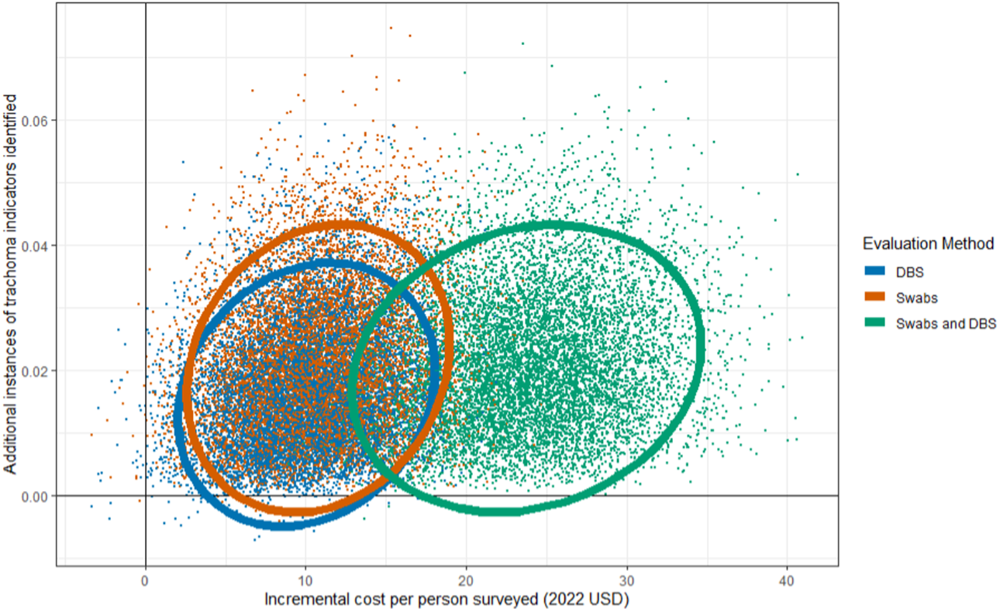
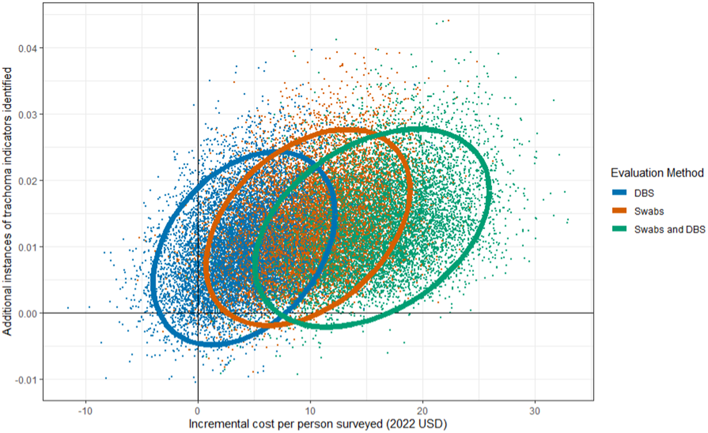

As countries move closer to eliminating trachoma, clinical grading becomes
harder to interpret. When prevalence is low, disagreement between graders or a
few misclassified cases can change whether a district appears to have crossed a
treatment threshold.

Emily Decker and her coauthors examined the cost of adding two biomarkers to
clinical grading: ocular swabs tested for current *Chlamydia trachomatis* (Ct)
infection, and dried blood spots (DBS) tested for antibodies that indicate
exposure and help describe transmission.[^paper]

## Comparing real survey costs

The study used expenditure records from enhanced surveys conducted in 2022 in
four districts in Tanzania and four in Mozambique. The researchers separated
the costs of grading, swab collection and testing, and DBS collection and
testing. They then estimated the additional cost for each trachoma indicator
identified beyond what grading alone found.

Adding both biomarkers increased the cost per cluster from $459.75 to $2,337.39
in Tanzania and from $1,381.46 to $2,147.12 in Mozambique. The percentage
increase was much larger in Tanzania, but the surveys were not identical:
Tanzania covered 10 clusters per evaluation unit, Mozambique covered 24, and
the Mozambican samples were processed in the United States.

The main cost drivers differed as well. Supplies and equipment dominated in
Tanzania; per diems were the largest cost in Mozambique. The difference says as
much about how a survey is delivered as it does about laboratory prices.

## One biomarker was usually better value

At the study's point estimates, ocular swabs were the better addition in
Tanzania: $475.25 per additional indicator identified, compared with $572.58
for DBS. In Mozambique, DBS was better value at $323.05, compared with $583.62
for swabs. Adding both cost $1,048.29 per additional indicator in Tanzania and
$949.34 in Mozambique, without finding more indicators than the better
individual method.

*Figure 4 from Decker et al., licensed [CC BY 4.0](https://creativecommons.org/licenses/by/4.0/). The horizontal axis is incremental cost per person surveyed; the vertical axis is additional trachoma indicators identified.*

The Tanzania simulations overlap substantially. The combined method costs more
without adding much effect. Mozambique shows more uncertainty, especially for
DBS, but the combined method again sits at the high-cost end without a matching
gain in information.

*Figure 5 from Decker et al., licensed [CC BY 4.0](https://creativecommons.org/licenses/by/4.0/).*

A scenario in which Mozambique processed samples locally narrowed the gap. It
reduced the estimated cost of swabs by 15.2%, bringing the swab and DBS ratios
close together. The cheapest test depends on laboratory capacity, shipping,
training, staffing, and survey scale; it is not a fixed property of the test.

## Different tests answer different questions

The ratios do not make swabs and DBS scientific substitutes. PCR testing of an
ocular swab looks for current infection. Serology from a blood spot reflects
antibodies and can help estimate past or ongoing transmission. A program may
still want both tests when the combined option has the least favorable ratio,
because the two measurements answer different questions.

There are also no World Health Organization thresholds yet for using PCR or
serology to make trachoma program decisions. The study measures the cost of
additional information, not downstream health gains, and the new survey methods
had start-up and training costs that could fall with routine use. Results will
also change with test sensitivity, local prevalence, geography, and the way a
laboratory pools and retests samples.

Enhanced testing can find information that grading misses, but the choice of
biomarker should follow the budget and the epidemiological question. In these
two implementations, choosing one biomarker gave a better cost-to-information
balance than automatically collecting both.

[^paper]: Emily C. Decker et al., “[Cost-effectiveness of adding measurement of *Chlamydia trachomatis* infection and serology to trachoma prevalence surveys in Tanzania and Mozambique](https://doi.org/10.1371/journal.pntd.0013257),” *PLOS Neglected Tropical Diseases* 19, no. 7 (2025): e0013257. The article, figures, and supporting materials are open access under CC BY 4.0.
