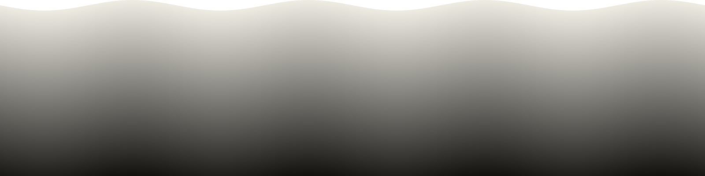
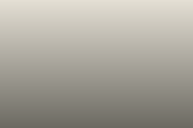
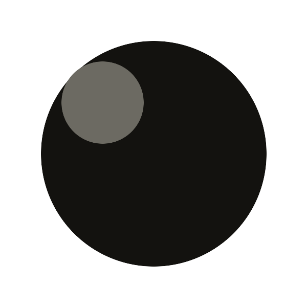

The pipeline is the single largest lever on what a reader pays to load this
site, so it gets the most adversarial fixtures. Each plate below is here
because it breaks something, not because it looks good.

Every one is written as plain markdown — `` — and
goes through `_markup/render-image.html` and `_partials/image.html` exactly as
a real article would. No shortcodes, because the point is to exercise the path
authors actually use.

## First plate, eager

This is `.Ordinal 0`, so it is marked `loading="eager" fetchpriority="high"`.
It sits in the initial viewport and would be fetched at load regardless; the
attributes reorder a request that was already going to happen rather than
adding one.

A panorama is also where a wrong `sizes` costs the most. `sizes` resolves
against width, so an over-broad value makes the browser pick a candidate far
larger than the slot it will occupy — on a 1600px-wide source that is the
difference between the 320 and the 1200 variant.

## Grayscale

Grayscale sources were on record as unencodable to AVIF — libavif's
`encodeGray` path failing — which would mean a `<source>` pointing at nothing
and a broken image for every reader whose browser prefers AVIF, which is most
of them.

**It does not reproduce here.** This plate is a genuine 8-bit `Gray` colorspace
PNG, and Hugo 0.164 emits a full AVIF ladder for it. The reason shows up in the
output: every variant identifies as `sRGB`, because resizing normalizes the
colorspace before the encoder is reached, so `encodeGray` is never called. A
grayscale source that is *resized* — which is every source in this pipeline,
since the width ladder always resizes — never takes that path.

That is what a fixture is for. The bug was believed live and scheduled for a
fix; one plate settled it in a single build. Whether an unresized grayscale
source still fails is untested and unimportant here, because nothing in this
theme emits one. What remains asserted is the invariant rather than the
diagnosis: `tools/check-exercises.py` fails if a `<picture>` ever loses one of
its two sources, whatever the cause.

## Narrower than the smallest variant

The configured ladder is 320/480/640/800/1200 and this source is 240px wide.
Nothing in the emitted `srcset` may exceed 240. Hugo will happily upscale past
the source width if asked, which spends bytes inventing detail that was never
captured — the worst possible trade for this audience.

## Portrait

Taller than it is wide and past the top of the ladder. Exercises the `height`
attribute and the intrinsic aspect ratio, which together are what stop the
plate from shifting layout as it loads.

## Transparency

Alpha survives AVIF and WebP but not JPEG. This is also where a naive flatten
onto white would show, since the page background is Bone rather than Snow.

## A real plate, resolved from assets

The five plates above are page-bundle siblings. This one has no sibling match
and falls through to `assets/`, exercising the second resolution branch and the
per-image quality lookup in `data/imagequality.json`, which records q70 for
this texture against q25 for a soft gradient.

Note the difference from the *link* hook: an image destination is processed
into derivatives, so only the variants are published. A link destination is
published as-is. Linking this same file would ship all 9.6 MB of it.
